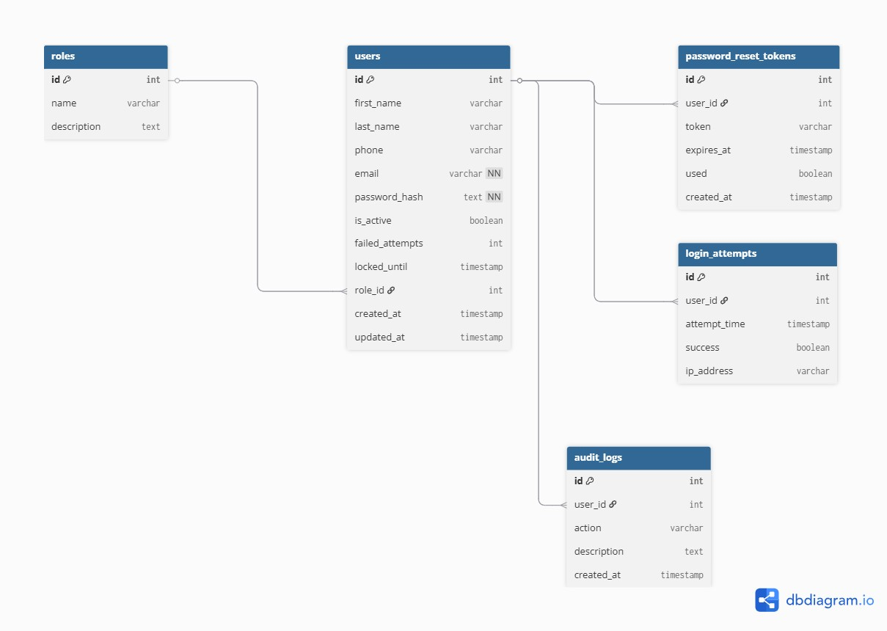

#  Documentación del Sistema 
---
## 1. Módulo de Usuarios

##  1.1 Requerimientos Funcionales

###  Usuario

- **RF01:** Como usuario quiero registrarme en la plataforma con nombre, apellido, teléfono, email y contraseña para acceder a la plataforma.  
- **RF02:** Como usuario quiero iniciar sesión con mi correo y contraseña para acceder a mi cuenta.  
- **RF03:** Como usuario quiero recuperar mi contraseña recibiendo un correo automatizado.  

###  Administrador

- **RF04:** Listar, filtrar y paginar usuarios por diferentes criterios (nombre, apellido, etc.).  
- **RF05:** Administrar cuentas (activar, desactivar, actualizar y eliminar usuarios).  
- **RF06:** Asignar roles a los usuarios.  
- **RF07:** Validar que el correo electrónico no esté previamente registrado.  
- **RF08:** Bloquear temporalmente cuentas tras múltiples intentos fallidos.  
- **RF09:** Visualizar historial básico de acciones de usuarios.  

---

##  1.2. Requerimientos No Funcionales

###  Seguridad

- **RNF01:** Contraseñas cifradas con algoritmos seguros.  
- **RNF02:** Protección de datos personales.  
- **RNF03:** Autenticación segura.  
- **RNF04:** Uso de HTTPS.  
- **RNF05:** Control de acceso basado en roles.  

###  Rendimiento

- **RNF06:** Respuesta de login menor a 2 segundos.  
- **RNF07:** Soporte para múltiples usuarios concurrentes.  

###  Usabilidad

- **RNF08:** Interfaz intuitiva.  
- **RNF09:** Mensajes claros en errores.  

###  Compatibilidad

- **RNF12:** Acceso desde PC, tablet y móvil.  

---

## 1.3. Product Backlog (Historias de Usuario - Usuarios)

| ID   | Historia de Usuario | Prioridad |
|------|--------------------|----------|
| US01 | Registro de usuario | Alta |
| US02 | Inicio de sesión | Alta |
| US03 | Recuperación de contraseña | Alta |
| US04 | Listado y filtrado de usuarios | Alta |
| US05 | Gestión de usuarios | Alta |
| US06 | Asignación de roles | Alta |
| US07 | Historial de acciones | Media |

---

## 1.4. Tareas Técnicas

| ID   | Tarea | Prioridad |
|------|------|----------|
| TK01 | Validar correo único | Alta |
| TK02 | Bloqueo por intentos fallidos | Alta |

---

## 1.5. Definition of Done (DoD)

Un PBI se considera terminado cuando:

- El código compila sin errores  
- Se desarrolla en rama `feature/*`  
- Se integra correctamente en `develop`  
- Se usan variables de entorno  
- APIs probadas (Postman / Swagger)  
- Commits con estándar (`feat`, `fix`, `chore`)  

---

## 1.6. Modelo de Base de Datos

A continuación se muestra el diseño de la base de datos del sistema:

---

## 2. Módulo de Gestión de Eventos y Capacidad Logística

---

##  2.1 Requerimientos Funcionales

###  Organizador

- **RF10:** Crear eventos con nombre, descripción, fecha, hora y ubicación.  
- **RF11:** Definir capacidad máxima de asistentes por evento.  
- **RF12:** Indicar si el evento cuenta con parqueadero.  
- **RF13:** Registrar cantidad de cupos de parqueadero.  
- **RF14:** Asociar el evento al usuario creador.  
- **RF15:** Editar eventos existentes.  
- **RF16:** Consultar listado de eventos.  
- **RF17:** Consultar detalle de un evento.  

---

##  2.2 Requerimientos No Funcionales

- **RNF06:** Validación de campos obligatorios en eventos.  
- **RNF07:** Control de acceso por roles (ADMIN / ORGANIZER).  
- **RNF08:** Persistencia en PostgreSQL.  
- **RNF09:** APIs REST con respuesta menor a 2 segundos.  
- **RNF10:** Uso de JWT para autenticación y autorización.  

---

##  2.3 Product Backlog (Historias de Usuario - Eventos)

| ID   | Historia de Usuario | Prioridad |
|------|--------------------|----------|
| US08 | Creación de entidad Evento | Alta |
| US09 | Registro de evento | Alta |
| US10 | Edición de eventos | Alta |
| US11 | Listado de eventos | Alta |
| US12 | Detalle de evento | Alta |
| US13 | Capacidad máxima | Media |
| US14 | Parqueadero | Media |
| US15 | Estados del evento | Media |

---

##  2.4 Definition of Done (DoD - Eventos)

Un PBI de eventos se considera terminado cuando:

- Endpoint funcional en `/api/events`  
- Validaciones implementadas  
- Persistencia en PostgreSQL  
- Relación con usuario creador  
- Uso de DTOs  
- Pruebas en Postman / Swagger  
- Merge a `develop`  
- Rama `feature/*` utilizada  

---

## Arquitectura Tecnológica

La arquitectura del sistema sigue un enfoque desacoplado basado en servicios, donde el backend expone una API REST consumida por un frontend independiente.

---

###  Backend

- Spring Boot  
- Spring Security  
- JWT  

El backend está construido como una API REST encargada de la lógica de negocio, autenticación, autorización y gestión de usuarios.

---

###  Seguridad

- Spring Security  
- JWT (JSON Web Tokens)  

Se implementa autenticación basada en tokens, permitiendo un sistema seguro, escalable y sin estado (stateless).  
El acceso a los recursos está controlado mediante roles de usuario.

---

###  Persistencia

- Spring Data JPA  
- Hibernate  

Se utiliza un enfoque ORM para mapear entidades a la base de datos, facilitando el manejo de datos y reduciendo la complejidad del acceso a información.

---

###  Base de Datos

- PostgreSQL  
- Supabase  

La base de datos se encuentra en la nube mediante Supabase, permitiendo acceso remoto, escalabilidad y facilidad de configuración.

---

###  Frontend

- React.js  

El frontend está desarrollado como una aplicación independiente que consume la API REST del backend, permitiendo una experiencia de usuario dinámica e interactiva.

---

###  Contenerización

- Docker  

Se utiliza Docker para empaquetar la aplicación y sus dependencias en contenedores, asegurando consistencia en los entornos de desarrollo y facilitando la portabilidad del sistema.

---

###  Control de Versiones

- Git  
- GitFlow  

El proyecto utiliza GitFlow para organizar el desarrollo colaborativo mediante ramas `main`, `develop` y `feature/*`, asegurando un flujo de integración ordenado.

---

###  Integración General

El sistema funciona bajo el siguiente flujo:

Frontend (React) → API REST (Spring Boot) → Base de Datos (PostgreSQL)

Esta arquitectura permite una separación clara de responsabilidades, facilitando el mantenimiento, la escalabilidad y la evolución del sistema.

---

## Conclusión

El sistema está diseñado bajo buenas prácticas de desarrollo, seguridad y escalabilidad.  
Se implementa una arquitectura moderna basada en APIs REST, autenticación segura y control de acceso por roles.

---
